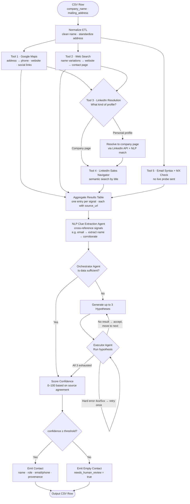

# PLAN.md

## Architecture

**Input:** CSV with `company_name` + `mailing_address`.  
**Output:** Same rows enriched with `contact_name`, `contact_role`, `contact_email_or_phone`, `confidence_score`, `source`, `needs_human_review`.

A small ETL step normalizes each incoming row. For every row, an orchestrator agent fans out to a set of lookup tools in parallel — each tool wraps an external API or data source. Results are aggregated, analyzed, scored, and written to the output.

### Lookup tools (Phase 1 — parallel)

**Tool 1 — Google Maps lookup**  
Search the mailing address in Google Maps to retrieve any registered phone number, website, Instagram account, or LinkedIn link.

**Tool 2 — Web / Google search**  
Search the company name and name variations in Google to find any public website. If a website is found, check its data policy; if permitted, crawl the contact page for email addresses or phone numbers.

**Tool 3 — LinkedIn profile resolution**  
If Tool 1 or Tool 2 surfaces a LinkedIn URL, inspect it to determine the profile type:
- *Company page found directly* → pass it straight to Tool 4.
- *Personal profile found first* → use the LinkedIn API to find the company page the person is associated with; run NLP to confirm it matches the target company, then pass that company page to Tool 4.

**Tool 4 — LinkedIn Sales Navigator / API**  
Using the confirmed LinkedIn company page (from Tool 3), search for people at the company filtered by job title. This enables a semantic search for decision-makers (AP manager, Owner, CFO, office manager). Tool 4 only runs if Tool 3 produced a confirmed company page.

**Tool 5 — Email syntax + MX validation**  
For any candidate email found, perform a syntax check and an MX-record DNS lookup to confirm the domain accepts mail. No live probe is sent to the mail server.

### Aggregation & NLP analysis

All tool outputs are collected into an intermediate results table — one entry per signal, each carrying a `source_url`. An NLP pass then cross-references signals for additional clues. For example, if an email like `rafael@imtheceo.com` is found, extract the name and run a corroborating search (`"rafael" + "CEO" + company name`) to confirm the identity.

### Phase 2 — Agent evaluation loop

The orchestrator agent reviews the aggregated table and decides whether the data is sufficient to identify a meaningful decision-maker contact. If not, it generates up to **3 hypotheses** for how to find the contact (e.g., "check state business registry", "search for press mentions of the owner"). The executor agent attempts each hypothesis in order:
- **No meaningful result returned** → accept the outcome and move to the next hypothesis; do not retry.
- **Hard error (4xx / 5xx from the tool)** → retry that hypothesis once before moving on.

After all 3 hypotheses are attempted (or a confident contact is found), the loop exits. If no contact was found, the row is emitted with `needs_human_review = true`.

### Data flow (per row)

1. Normalize company name + address.
2. Fan out to all lookup tools in parallel (Phase 1).
3. Aggregate results; run NLP clue extraction.
4. Agent evaluates sufficiency; if insufficient, run hypothesis loop (Phase 2).
5. Merge final results: agreement across sources raises confidence; a single unverifiable source keeps it low.
6. If `confidence_score < threshold` → emit empty contact + `needs_human_review = true`.
7. Write output row with `source_url` provenance per field.

### Flow diagram

<!-- GAPS — needs answers before building:
  - What is the execution model? Batch (process all rows at once) or one-at-a-time CLI call?
  - If a source times out or errors, does the row fail entirely or continue with remaining sources?
  - Is there intermediate storage (DB, JSON file) or is it pure CSV-in → CSV-out?
-->

## Sources & strategy

- **Business registry** (government/state-level): cross-reference mailing address → registered agent / owner name. Most authoritative for ownership; often missing for very small businesses.
- **Web/maps listing** (Google Maps or equivalent): look up company name + address → public business phone, sometimes a contact name. May return only a generic listing with no person.
- **Email/phone enrichment provider**: given company name/domain → candidate email or phone with provider-reported confidence. Individually fallible; treat as a signal, not a fact.

Cross-referencing strategy: agreement between sources raises confidence. A contact only from enrichment with no corroboration stays low-confidence.

Only public, business-facing data. Check terms of service before using any real source.

<!-- GAPS — needs answers before building:
  - What is the priority order when multiple sources return different people? (e.g., registry says Owner, enrichment says CFO)
  - How should conflicting names be handled — pick highest-confidence source, flag for review, or surface all candidates?
  - Are there specific disallowed source types (LinkedIn scraping, paid databases)?
-->

## Quality

**Confidence score logic (0–100):**
- Start at 0.
- Each independent source that returns a contact: +points (exact weight TBD).
- Sources that agree on the same name/contact: multiplier or bonus.
- `provider_confidence` from enrichment provider is a signal, not the final score.
- Single unverifiable source with no corroboration → score stays below threshold.

**"Cannot verify" representation:** `confidence_score < threshold` → `contact_email_or_phone = ""`, `needs_human_review = true`. Never fabricate a contact.

**Provenance:** every output field carries a `source` column listing the `source_url(s)` it came from. No value emitted without an attributable source.

**Dedupe:** if two sources return the same person (name fuzzy-match + same company), merge into one candidate and boost confidence rather than returning duplicates.

<!-- GAPS — needs answers before building:
  - What exact confidence threshold separates "emit contact" from "needs_human_review"? (likely 70, but confirm)
  - What scoring weight difference between "one agreeing source" vs "two agreeing sources"?
  - How strict is name deduplication? Exact match only, or fuzzy (e.g., "Dan Ortega" vs "Daniel Ortega")?
  - What happens if two sources agree on the same name but give conflicting emails?
-->

## Privacy / compliance

**Will do:**
- Use only publicly available, business-facing data (B2B contacts only).
- Record provenance (`source_url`) for every value so any contact can be audited.
- Support suppression: skip rows where company/contact is on an opt-out list.
- Check terms of service for each data source before using it in production.

**Will NOT do:**
- Collect personal/home addresses or personal phone numbers.
- Infer identity from protected characteristics.
- Use dark-pattern scraping (bypassing robots.txt, fake user agents, login walls).
- Store more data than needed to produce the output.

<!-- GAPS — needs answers before building:
  - Is there an existing suppression/opt-out list to check against, or does this need to be built?
  - What jurisdiction applies — US only, EU (GDPR), or both?
  - What is the data retention policy for enriched output — delete after use, or store in a DB?
-->

## Clarifying questions

1. **Who is the target decision-maker when multiple roles are present?**
   - Why it matters: if registry returns an Owner and enrichment returns a CFO, I need a priority order to pick one.
   - Default assumption: Owner / founder first for small businesses; AP manager or CFO for larger ones.
   - What changes if answered: the merge/selection logic in step 3 of the data flow.

2. **What is the confidence threshold for "needs_human_review"?**
   - Why it matters: the threshold determines how many rows get flagged vs. emitted — directly sets precision/recall trade-off.
   - Default assumption: 70 out of 100.
   - What changes if answered: the scoring cutoff in the output step; may also change how aggressively I boost single-source results.

3. **Are we optimizing for precision (fewer, more accurate contacts) or recall (more contacts, some uncertain)?**
   - Why it matters: it changes whether I should emit a low-confidence guess or leave the row blank and flag it.
   - Default assumption: precision over recall — a high `needs_human_review` rate on genuinely hard rows is acceptable.
   - What changes if answered: the threshold itself, and whether I surface multiple candidates per row.
