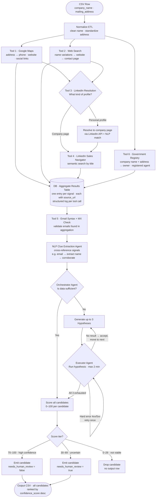

# PLAN.md

## Architecture

**Input:** CSV with `company_name` + `mailing_address`.  
**Output:** Per input row, one or more candidate rows each containing `contact_name`, `contact_role`, `contact_email_or_phone`, `confidence_score` (0–100), `source`, `needs_human_review`. All candidates are returned, ranked by confidence score descending.

### Execution model & constraints

- **Sequential per row.** Rows are processed one at a time; no cross-row parallelism.
- **Phase 1 timeout: 2 minutes.** All Phase 1 tool calls fan out in parallel within the row. Any tool that has not responded within 2 minutes is treated as a non-result and excluded from aggregation; the row proceeds with whatever arrived.
- **Phase 2 timeout: 2 minutes per hypothesis attempt.** Each executor agent attempt has its own 2-minute cap.
- **Persistence.** After each row, results and tool logs are written to a local SQLite database. A run can be interrupted and resumed without reprocessing completed rows.
- **Structured logging.** Every tool call records its inputs, outcome, HTTP status, duration, and any error to the database. This log is the primary artifact for post-run failure analysis and source-quality tracking.

### Lookup tools (Phase 1 — parallel within each row)

**Tool 1 — Google Maps lookup**  
Search the mailing address in Google Maps to retrieve any registered phone number, website, Instagram account, or LinkedIn link.

**Tool 2 — Web / Google search**  
Search the company name and name variations in Google to find any public website. If a website is found, check its data policy; if permitted, crawl the contact page for email addresses or phone numbers.

**Tool 3 — LinkedIn profile resolution** *(depends on Tool 1 or Tool 2 returning a LinkedIn URL)*  
Inspect the LinkedIn URL to determine the profile type:
- *Company page found directly* → pass it straight to Tool 4.
- *Personal profile found first* → use the LinkedIn API to find the associated company page; run NLP to confirm it matches the target company, then pass that page to Tool 4.

**Tool 4 — LinkedIn Sales Navigator / API** *(depends on Tool 3 confirming a company page)*  
Search for people at the confirmed company page filtered by job title, enabling a semantic search for decision-makers (AP manager, Owner, CFO, office manager). Only runs if Tool 3 produced a confirmed company page.

**Tool 5 — Email syntax + MX validation** *(runs after aggregation, on any emails found by Tools 1–4 and 6)*  
For each candidate email collected, perform a syntax check and an MX-record DNS lookup to confirm the domain accepts mail. No live probe is sent to the mail server. Emails that fail validation are flagged and excluded from output.

**Tool 6 — Government / state business registry lookup**  
Search state-level business registries using both the company name and the mailing address. Returns the registered agent, owner of record, or corporate officers filed with the state. Most authoritative source for ownership data; coverage varies by state and may be absent for sole proprietors or informally registered businesses.

### Aggregation & NLP analysis

All tool outputs (Tools 1, 2, 4, 6) are collected into the intermediate results table in the database — one entry per signal, each carrying a `source_url`. Tool 5 then validates any emails in the table. A second-agent NLP pass cross-references signals for additional clues — for example, if an email like `rafael@imtheceo.com` is found, extract the name and run a corroborating search (`"rafael" + "CEO" + company name`) to confirm the identity.

### Phase 2 — Agent evaluation loop

The orchestrator agent reviews the aggregated table and decides whether the data is sufficient to identify at least one meaningful decision-maker contact. If not, it generates up to **3 hypotheses** for how to find the contact (e.g., "check state business registry for a different state spelling", "search for press mentions of the owner"). The executor agent attempts each hypothesis in order:

- **No meaningful result** → accept the outcome, move to the next hypothesis. Do not retry.
- **Hard error (4xx / 5xx from the tool)** → retry that hypothesis once, then move on.

After all 3 hypotheses are attempted (or a sufficient contact is found), the loop exits. If no contact was found, the row is emitted with `needs_human_review = true` and an empty contact.

### Data flow (per row)

1. Normalize company name + address.
2. Fan out to Tools 1, 2, and 6 in parallel; Tools 3 and 4 chain from their dependencies. Wait up to **2 min** — any tool still running at timeout is dropped.
3. Collect all signals into the DB. Run Tool 5 (email validation) on any emails found.
4. NLP clue extraction agent cross-references aggregated signals.
5. Orchestrator evaluates sufficiency. If insufficient, run hypothesis loop (Phase 2, up to **2 min** per attempt, max 3 attempts).
6. Score all candidates; produce ranked list.
7. Write all candidates + full tool log to DB; append enriched rows to output CSV.

### Flow diagram

---

## Sources & strategy

Sources are listed in descending order of authority:

1. **Government / state business registry** (Tool 6): company name + address → registered agent, owner of record, or corporate officers. Most authoritative; coverage varies by state and may be absent for sole proprietors.
2. **Web / maps listing** (Tool 1 — Google Maps): mailing address → public business phone, website, social links. May return only a generic listing with no named person.
3. **Web / Google search** (Tool 2): company name variations → public website → contact page email or phone.
4. **LinkedIn** (Tools 3 + 4): company page → decision-makers filtered by job title via Sales Navigator. Dependent on finding a verifiable company page first.
5. **Email/phone enrichment signals** (validated by Tool 5): candidate emails or phones found via any of the above sources. Always validated with MX check before emitting. Treat provider-reported confidence as a signal, not a final score.

**Cross-referencing strategy:** agreement between independent sources raises confidence. Government registry data, when present, carries the highest intrinsic weight. A contact returned by only one source with no corroboration stays low-confidence.

Only public, business-facing data. Terms of service must be verified for each source before production use.

---

## Quality

**Confidence score (0–100):**
- Start at 0 for each candidate.
- Each independent source that returns the same contact: +points. Weights are configurable; defaults place government registry data higher than web or enrichment sources.
- Sources that independently agree on the same name: score multiplier.
- `provider_confidence` from any enrichment provider is one input signal, not the final score.
- A single unverifiable source with no corroboration keeps the score below the human-review threshold.

**Score tiers (configurable defaults):**

| Range | Meaning | Output behaviour |
|-------|---------|-----------------|
| 70–100 | High confidence | Emit contact · `needs_human_review = false` |
| 30–69  | Uncertain | Emit contact · `needs_human_review = true` |
| 0–29   | Not viable | Drop — no output row for this candidate |

**Output:** All viable candidates (score ≥ 30) are returned per input row, ranked by `confidence_score` descending, each with their `contact_role` and `source` provenance. The caller decides how many candidates to act on.

**"Cannot verify":** if all candidates for a row score below 30, emit one row with empty contact fields and `needs_human_review = true`. Never fabricate a contact.

**Provenance:** every output field carries `source` listing the `source_url(s)` it came from. No value is emitted without an attributable source.

**Dedupe:** if two sources return the same person (fuzzy name match + same company), merge into one candidate and apply the cross-source confidence boost rather than emitting duplicates.

---

## Privacy / compliance

**Will do:**
- Use only publicly available, business-facing data (B2B contacts only — no personal/home data).
- Record `source_url` provenance for every value so any contact can be audited back to its origin.
- Support suppression: skip any row where the company or contact appears on an opt-out list.
- Enforce a **1-year data retention limit**: enriched records and tool logs are deleted from the database after 1 year of inactivity.
- Make source-access rules **configurable per tool**: which states or jurisdictions a tool is permitted to query is a config value, not hardcoded, so legal or compliance changes can be applied without a code deployment.
- Check terms of service for each data source before enabling it in production.

**Will NOT do:**
- Collect personal/home addresses or personal phone numbers.
- Infer identity from protected characteristics.
- Use dark-pattern scraping (bypassing robots.txt, fake user agents, login-wall circumvention).
- Store more data than is needed to produce and audit the output.
- Query any source for a state or jurisdiction where access has not been cleared.

---

## Clarifying questions

1. **What is the priority order for decision-maker roles when multiple candidates are found?**
   - Why it matters: the output returns all candidates ranked by confidence, but the client may want a secondary sort by role type (e.g., AP manager always surfaces first, regardless of score).
   - Default assumption: sort by `confidence_score` descending only; role preference is left to the caller.
   - What changes if answered: a secondary sort key or a role-weight multiplier in the scoring step.

2. **What is the confidence threshold, and are the three tiers the right split?**
   - Why it matters: the 0–29 / 30–69 / 70–100 split determines how many candidates are dropped, flagged, or emitted — directly setting the precision/recall trade-off.
   - Default assumption: thresholds as defined above; all values are configurable.
   - What changes if answered: the cutoff constants; may also change whether a single-source enrichment result is emitted or dropped.

3. **Should the system return only the single best candidate per company, or all viable candidates?**
   - Why it matters: returning all candidates gives the outreach team options but increases review volume; returning one demands more confidence in the scoring logic.
   - Default assumption: return all candidates with score ≥ 30, ranked by confidence. The caller filters.
   - What changes if answered: output schema changes from 1-to-many to 1-to-1 per input row; scoring must be more conservative if only one result is emitted.
